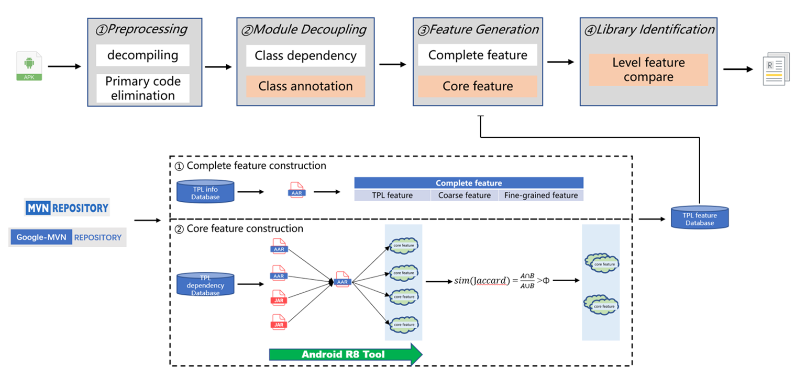

# 项目介绍

我们提出了一个名为LibScanner的系统，该系统可以精确定位Android应用内的第三方库（TPL）版本，并提供有关TPL的详细信息。

该系统可以对抗Android应用中使用的常见混淆，尤其在应用使用了**死代码移除混淆技术**时，我们通过分析TPL间依赖关系构建的核心特征集合可以有效减小应用死代码移除所带来的影响。并且根据TPL被其他TPL的依赖情况分析，选取合适阈值对构建的核心特征集合进行拆分，进一步提升TPL检测的精度，与现有Android应用TPL检测工具比较，在TPL检测准确率和召回率都有很大提升。


# 背景

第三方库(TPL)已经成为Android生态系统的重要组成部分。开发者可以使用各种第三方库来促进他们的应用开发。第三方库是一把双刃剑。一方面，它可以简化移动应用程序的开发。另一方面，它也带来了安全风险，比如识别恶意软件和重新打包的应用程序以及第三方库中存在的某些漏洞，进而导致用户隐私泄露或增加攻击面(如引入过度特权权限)的移动应用程序。



Android应用中，第三方库和应用程序代码都被打包进入APK中，模糊了应用程序代码和库代码之间的关系，并且使用了各种各样的混淆策略，当使用 Android Gradle 插件 3.4.0或更高版本构建项目时，默认使用r8作为项目的混淆工具。根据对所有主流Android应用第三方库检测工具的检测能力分析，所有工具都不能有效处理由于使用混淆工具（proguard、r8）开启死代码移除所带来的影响，在这种情况下，需要一种精确可靠的库检测器。


# 安装

## 克隆项目

您可以通过**git**使用以下命令克隆项目到本地：

http_url:    `git clone https://git.openi.org.cn/watchman/Watchman-tool.git` （待修改）

   

ssh_url:    `git clone git@git.openi.org.cn:watchman/Watchman-tool.git` （待修改）

## 环境配置

- **操作系统**：Windows 10、UBUNTU

- **相关依赖**：

  （待修改）

  ```
  Python(==3.6)DBUtils(>=3.0.2)GitPython(>=3.1.18)PyMySQL(>=1.0.2)requests(>=2.27.1)selenium(>=3.141.0)BeautifulSoup4(>=4.10.0)
  ```

- **数据库**：MySQL数据库，开发者可以通过导入sql目录下的.sql文件建立数据库表结构。

# 快速使用说明

## 检测架构

LibScanner可以检测和识别Android应用中的TPL和具体的版本，检测流程主要分为**4个部分**，首先是**预处理**，反编译APK项目并且删除开发者编写的代码；第二部分是**模块解耦**，根据类依赖关系对APK中的第三方库进行解耦，相比最新Android应用TPL检测工具，这部分我们添加了类之间的注解关系作为补充；第三部分是**特征生成**，主要分为完全特征和核心特征两部分，完全特征是根据TPL代码进行的全量构建以应对没有被死代码移除的TPL，核心特征是TPL中被其他TPL真正调用的那部分代码，用于用对死代码移除导致部分特征确实的情况；最后一部分是**库信息识别**，根据特征匹配算法检测出Android应用中的TPL，其技术架构如下：


## APK预处理

LibScanner在这个部分的主要任务是排除开发者编写的代码模块，想准确检测APK中的TPL信息，开发者编写的代码会对检测产生干扰，因为在模块解耦阶段，开发者编写的代码和依赖的TPL之间存在较强的耦合性，收到开发者编写代码的影响，不能有效进行TPL模块解耦。

开发者编写的代码可以在项目的AndroidManifest.xml文件中获取开发者编写代码模块的包名，通过解析AndroidManifest.xml文件即可排除开发者编写代码。在一些情况下，开发者编写代码可能存在不同的命名空间下，需要根据四大组件（Activity、Service、Content Provider、Broadcast Receiver）综合判断。

## 模块解耦

模块解耦的目的是将应用的非开发者编写的代码根据类依赖关系拆分为不同的候选模块。模块解耦中考虑4中类依赖关系：**类继承关系**、**方法调用关系**、**字段引用关系**、**类注解引用关系**。对于给定的APK，排除开发者编写代码影响后，采用上述四种关系对所有代码进行分析，每个独立的连通分量都将作为一个TPL的候选实例。

在以往Android TPL检测工具中没有使用到类注解关系，经过分析会漏掉一些类，导致模块解耦不够准确。在模块解耦时添加类注解关系使得TPL候选实例划分更加准确。

## 特征构建

在分离候选TPL之后，我们的目标是提取特征并生成指纹(又名签名)来表示每个TPL文件。这个部分中我们使用两种特征来表示每个TPL文件，**完全特征和核心特征**。从特征粒度划分，分为**TPL特征、粗粒度特征和细粒度特征**。与现有TPL检测工具类似，**粗粒度特征**使用CFG（Control Flow Graph），对于**细粒度特征**，我们提取CFG的每个基本块中的操作码作为特征进行精确的版本识别。

在Android项目打包成APK文件过程中，出于安全以及项目体积大小的考虑，开发者会采取一些代码混淆策略，当项目被应用了死代码移除混淆策略时，项目依赖的TPL中没有被实际使用的代码会被删除掉，由于我们是基于TPL构建特征数据库进行相似度比较从而识别TPL具体信息。使用死代码移除技术会导致在相似度比较时缺失部分特征而达不到相似度匹配的阈值而发成漏报的情况。为了应对上述情况的影响，我们提出了完全特征和核心特征。完全特征是基于TPL全量代码构建的特征，用于匹配没有被死代码移除的情况，核心特征是根据TPL间依赖关系调用的代码分析得到的频繁被调用的那部分代码（非全量），用于匹配由于死代码移除影响的TPL。

### 特征数据库设计

特征数据库表的主要字段如下：TPL的group_id、artifact_id、version、package_name等基本信息，另外就是TPL特征相关信息：完全特征包括TPL特征、粗粒度特征、细粒度特征；核心特征是根据细粒度方式构建的。


### 完全特征构建

针对每个TPL构建全部代码的特征存储在特征数据库中，根据特征粒度的不同分为TPL特征、粗粒度特征、细粒度特征。


**特征构建**是从下到上的一个过程，首先是方法级的细粒度特征，然后是类级别的粗粒度特征，最后是TPL级别的特征。

- **方法级特征**：对于每个TPL中方法，通过静态分析方式构建CFG，然后根据每个CFG中Basic Block中的操作码作为特征，通过Hash的方式生成方法级特征。

- **类级别特征**：对于构建好的方法级特征，根据每个类中包含的不同方法，对每个类中方法生成的特征进行排序、拼接、哈希作为类级别特征。

- **TPL级别特征**：与类级别特征类似，一个TPL中包含若干个类，对每个类生成的特征进行排序、拼接、哈希作为TPL特征。

**特征匹配**时是一个从上到下的过程，依次比较TPL特征、粗粒度特征、细粒度特征，若在某一特征级别识别到，则不继续比较下一级别特征，直接报告结果。

### 核心特征构建

核心特征是一个非全量的细粒度特征的集合。核心特征的构建主要分为3哥步骤：获取TPL依赖网络、根据TPL依赖关系构建核心特征、核心特征集合划分。

**获取TPL依赖网络**

核心特征是根据TPL间依赖关系构建的，需要提前构建好TPL依赖网络，我们在本地构建了TPL依赖关系数据库，依赖的来源主要分为两个仓库，maven仓库和google-maven仓库。


**TPL依赖关系构建核心特征集合**


核心特征的构建是通过R8工具实现的。一个TPL可能会有多个下游依赖，需要对每一对下游依赖进行分析，主要分为3个步骤：分析A调用B的集合、生成保留规则写入proguard.cfg中、使用R8工具对B进行代码收缩。

- 通过静态分析的方式，分析A调用了B的那些类、方法、字段。在处理中我们主要处理的TPL格式为.jar和.aar的TPL。

  ​	针对.jar格式

  ​	针对.aar格式

- 将得到的调用代码集合根据R8工具配置文件约束生成保留规则写入到proguard.cfg中。

  ​	例如：为类android.arch.core.internal.SafeIterableMap中init方法生成保留规则。

  ​	`-keep class android.arch.core.internal.SafeIterableMap { <init>(); }`

- 使用R8工具对目标TPL代码收缩，得到调用的核心方法集合。

  ```
  cmd = 'java -jar  %s ' \
        '--release ' \
        '--no-minification ' \
        '--output %s ' \
        '--pg-conf %s ' \
        '--lib E:\\android\\sdk\\platforms\\android-33\\android.jar ' \
        '--lib E:\\JDK8 %s' \
        % ('./libs/r8-3.2.74.jar', output_path, pg_conf_path, input_path)
  ```

**核心特征集合划分**


一个TPL可能有几个到数万个不等的下游依赖，那么通过TPL依赖关系构建的核心特征集合就会生成很多，如果将每个小特征集合存储在数据库中不仅会占用大量的存储空间而且会增加比较的时间。并且不同下游依赖产生的核心特征集合可能是一致的，这就需要通过一种方式对生成的核心特征集合进行合理的聚合，提高存储空间和比较时间的效率。

这部分我们通过每个核心特征集合的相似性将集合进行聚合成一个相对较大的集合，将所有的集合都采取相同的方式进行聚合，最后会产生几个聚合之后的集合，我们将此特征集合存储到特征数据库中。

在将不同下游依赖生成的核心特征集合进行聚合时，需要设定一个集合相似度阈值，根据这个阈值核心特征集合进行聚合，这个阈值的选择我们根据TPL级别的FNR（假阴性率）和FPR（假阳性率）来设定，进行不同的实验，选取合适阈值。

## 第三方库检测和版本识别

对于给定APK，根据上述描述操作，根据流程一步步进行判断，当达到相似度阈值后停止，给出结果。


# 使用指南

### 功能演示视频

暂时空置。


### APK检测示例

1. 待检测项目示例

   该项目来源F-Droid开源社区。

   项目链接：https://f-droid.org/zh_Hans/packages/org.bitbucket.watashi564.combapp/

   项目源码链接：https://f-droid.org/repo/org.bitbucket.watashi564.combapp_4_src.tar.gz

   项目APK链接：https://f-droid.org/repo/org.bitbucket.watashi564.combapp_4.apk

   

2. 项目依赖树展示

   下面列出了该项目的依赖树结果，作为我们TPL检测的benchmark，工涉及 个TPL。

   ```
   debugRuntimeClasspath - Resolved configuration for runtime for variant: debug
   +--- androidx.appcompat:appcompat:1.1.0
   |    +--- androidx.annotation:annotation:1.1.0
   |    +--- androidx.core:core:1.1.0
   |    |    +--- androidx.annotation:annotation:1.1.0
   |    |    +--- androidx.lifecycle:lifecycle-runtime:2.0.0 -> 2.1.0
   |    |    |    +--- androidx.lifecycle:lifecycle-common:2.1.0
   |    |    |    |    \--- androidx.annotation:annotation:1.1.0
   |    |    |    +--- androidx.arch.core:core-common:2.1.0
   |    |    |    |    \--- androidx.annotation:annotation:1.1.0
   |    |    |    \--- androidx.annotation:annotation:1.1.0
   |    |    +--- androidx.versionedparcelable:versionedparcelable:1.1.0
   |    |    |    +--- androidx.annotation:annotation:1.1.0
   |    |    |    \--- androidx.collection:collection:1.0.0 -> 1.1.0
   |    |    |         \--- androidx.annotation:annotation:1.1.0
   |    |    \--- androidx.collection:collection:1.0.0 -> 1.1.0 (*)
   |    +--- androidx.cursoradapter:cursoradapter:1.0.0
   |    |    \--- androidx.annotation:annotation:1.0.0 -> 1.1.0
   |    +--- androidx.fragment:fragment:1.1.0
   |    |    +--- androidx.annotation:annotation:1.1.0
   |    |    +--- androidx.core:core:1.1.0 (*)
   |    |    +--- androidx.collection:collection:1.1.0 (*)
   |    |    +--- androidx.viewpager:viewpager:1.0.0
   |    |    |    +--- androidx.annotation:annotation:1.0.0 -> 1.1.0
   |    |    |    +--- androidx.core:core:1.0.0 -> 1.1.0 (*)
   |    |    |    \--- androidx.customview:customview:1.0.0
   |    |    |         +--- androidx.annotation:annotation:1.0.0 -> 1.1.0
   |    |    |         \--- androidx.core:core:1.0.0 -> 1.1.0 (*)
   |    |    +--- androidx.loader:loader:1.0.0
   |    |    |    +--- androidx.annotation:annotation:1.0.0 -> 1.1.0
   |    |    |    +--- androidx.core:core:1.0.0 -> 1.1.0 (*)
   |    |    |    +--- androidx.lifecycle:lifecycle-livedata:2.0.0
   |    |    |    |    +--- androidx.arch.core:core-runtime:2.0.0
   |    |    |    |    |    +--- androidx.annotation:annotation:1.0.0 -> 1.1.0
   |    |    |    |    |    \--- androidx.arch.core:core-common:2.0.0 -> 2.1.0 (*)
   |    |    |    |    +--- androidx.lifecycle:lifecycle-livedata-core:2.0.0
   |    |    |    |    |    +--- androidx.lifecycle:lifecycle-common:2.0.0 -> 2.1.0 (*)
   |    |    |    |    |    +--- androidx.arch.core:core-common:2.0.0 -> 2.1.0 (*)
   |    |    |    |    |    \--- androidx.arch.core:core-runtime:2.0.0 (*)
   |    |    |    |    \--- androidx.arch.core:core-common:2.0.0 -> 2.1.0 (*)
   |    |    |    \--- androidx.lifecycle:lifecycle-viewmodel:2.0.0 -> 2.1.0
   |    |    |         \--- androidx.annotation:annotation:1.1.0
   |    |    +--- androidx.activity:activity:1.0.0
   |    |    |    +--- androidx.annotation:annotation:1.1.0
   |    |    |    +--- androidx.core:core:1.1.0 (*)
   |    |    |    +--- androidx.lifecycle:lifecycle-runtime:2.1.0 (*)
   |    |    |    +--- androidx.lifecycle:lifecycle-viewmodel:2.1.0 (*)
   |    |    |    \--- androidx.savedstate:savedstate:1.0.0
   |    |    |         +--- androidx.annotation:annotation:1.1.0
   |    |    |         +--- androidx.arch.core:core-common:2.0.1 -> 2.1.0 (*)
   |    |    |         \--- androidx.lifecycle:lifecycle-common:2.0.0 -> 2.1.0 (*)
   |    |    \--- androidx.lifecycle:lifecycle-viewmodel:2.0.0 -> 2.1.0 (*)
   |    +--- androidx.appcompat:appcompat-resources:1.1.0
   |    |    +--- androidx.annotation:annotation:1.1.0
   |    |    +--- androidx.core:core:1.0.1 -> 1.1.0 (*)
   |    |    +--- androidx.vectordrawable:vectordrawable:1.1.0
   |    |    |    +--- androidx.annotation:annotation:1.1.0
   |    |    |    +--- androidx.core:core:1.1.0 (*)
   |    |    |    \--- androidx.collection:collection:1.1.0 (*)
   |    |    +--- androidx.vectordrawable:vectordrawable-animated:1.1.0
   |    |    |    +--- androidx.vectordrawable:vectordrawable:1.1.0 (*)
   |    |    |    +--- androidx.interpolator:interpolator:1.0.0
   |    |    |    |    \--- androidx.annotation:annotation:1.0.0 -> 1.1.0
   |    |    |    \--- androidx.collection:collection:1.1.0 (*)
   |    |    \--- androidx.collection:collection:1.0.0 -> 1.1.0 (*)
   |    +--- androidx.drawerlayout:drawerlayout:1.0.0
   |    |    +--- androidx.annotation:annotation:1.0.0 -> 1.1.0
   |    |    +--- androidx.core:core:1.0.0 -> 1.1.0 (*)
   |    |    \--- androidx.customview:customview:1.0.0 (*)
   ```

   

3.  检测结果

   - ​	APK未被混淆情况

     当APK未被混淆的情况下，APK中的TPL都能以一个非常高的相似度检测出。

     ```json
     {
         "apk_file_name": "app-release-unsigned.apk",
         "apk_package_name": "org.bitbucket.watashi564.combapp",
         "libraries": [
             {
                 "group_id": "androidx.legacy",
                 "artifact_id": "legacy-support-core-utils",
                 "version": "1.0.0",
                 "similarity": 1,
                 "feature_type": "tpl_feature"
             },
             {
                 "group_id": "androidx.localbroadcastmanager",
                 "artifact_id": "localbroadcastmanager",
                 "version": "1.0.0",
                 "similarity": 1,
                 "feature_type": "tpl_feature"
             },
             {
                 "group_id": "androidx.print",
                 "artifact_id": "print",
                 "version": "1.0.0",
                 "similarity": 1,
                 "feature_type": "tpl_feature"
             },
             {
                 "group_id": "androidx.resourceinspection",
                 "artifact_id": "resourceinspection-annotation",
                 "version": "1.0.0",
                 "similarity": 1,
                 "feature_type": "tpl_feature"
             },
             {
                 "group_id": "com.google.guava",
                 "artifact_id": "listenablefuture",
                 "version": "1.0",
                 "similarity": 1,
                 "feature_type": "tpl_feature"
             },
             {
                 "group_id": "androidx.activity",
                 "artifact_id": "activity-ktx",
                 "version": "1.5.1",
                 "similarity": 1,
                 "feature_type": "course_feature"
             },
             {
                 "group_id": "androidx.activity",
                 "artifact_id": "activity",
                 "version": "1.5.1",
                 "similarity": 1,
                 "feature_type": "fine_grained_feature"
             },
             {
                 "group_id": "androidx.annotation",
                 "artifact_id": "annotation-experimental",
                 "version": "1.1.0",
                 "similarity": 1,
                 "feature_type": "course_feature"
             },
             {
                 "group_id": "androidx.annotation",
                 "artifact_id": "annotation",
                 "version": "1.3.0",
                 "similarity": 1,
                 "feature_type": "course_feature"
             },
             {
                 "group_id": "androidx.appcompat",
                 "artifact_id": "appcompat-resources",
                 "version": "1.4.2",
                 "similarity": 1,
                 "feature_type": "course_feature"
             },
             {
                 "group_id": "androidx.appcompat",
                 "artifact_id": "appcompat",
                 "version": "1.4.2",
                 "similarity": 1,
                 "feature_type": "fine_grained_feature"
             },
             {
                 "group_id": "androidx.arch.core",
                 "artifact_id": "core-common",
                 "version": "2.1.0",
                 "similarity": 1,
                 "feature_type": "course_feature"
             },
             {
                 "group_id": "androidx.arch.core",
                 "artifact_id": "core-runtime",
                 "version": "2.1.0",
                 "similarity": 1,
                 "feature_type": "course_feature"
             },
             {
                 "group_id": "androidx.cardview",
                 "artifact_id": "cardview",
                 "version": "1.0.0",
                 "similarity": 1,
                 "feature_type": "course_feature"
             },
             {
                 "group_id": "androidx.collection",
                 "artifact_id": "collection-ktx",
                 "version": "1.1.0",
                 "similarity": 1,
                 "feature_type": "course_feature"
             },
             {
                 "group_id": "androidx.collection",
                 "artifact_id": "collection",
                 "version": "1.1.0",
                 "similarity": 0.9523809523809523,
                 "feature_type": "core_feature_union"
             },
             {
                 "group_id": "androidx.concurrent",
                 "artifact_id": "concurrent-futures",
                 "version": "1.0.0",
                 "similarity": 1,
                 "feature_type": "fine_grained_feature"
             },
             {
                 "group_id": "androidx.constraintlayout",
                 "artifact_id": "constraintlayout-solver",
                 "version": "2.0.4",
                 "similarity": 0.991991991991992,
                 "feature_type": "fine_grained_feature"
             },
             {
                 "group_id": "androidx.constraintlayout",
                 "artifact_id": "constraintlayout",
                 "version": "2.0.4",
                 "similarity": 0.9906479625918504,
                 "feature_type": "fine_grained_feature"
             },
             {
                 "group_id": "androidx.coordinatorlayout",
                 "artifact_id": "coordinatorlayout",
                 "version": "1.0.0",
                 "similarity": 1,
                 "feature_type": "course_feature"
             },
             {
                 "group_id": "androidx.core",
                 "artifact_id": "core-ktx",
                 "version": "1.2.0",
                 "similarity": 0.9985096870342772,
                 "feature_type": "fine_grained_feature"
             },
             {
                 "group_id": "androidx.core",
                 "artifact_id": "core",
                 "version": "1.8.0",
                 "similarity": 0.9686847599164927,
                 "feature_type": "fine_grained_feature"
             },
             {
                 "group_id": "androidx.cursoradapter",
                 "artifact_id": "cursoradapter",
                 "version": "1.0.0",
                 "similarity": 1,
                 "feature_type": "course_feature"
             },
             {
                 "group_id": "androidx.customview",
                 "artifact_id": "customview",
                 "version": "1.1.0",
                 "similarity": 1,
                 "feature_type": "course_feature"
             },
             {
                 "group_id": "androidx.documentfile",
                 "artifact_id": "documentfile",
                 "version": "1.0.0",
                 "similarity": 0.9894736842105263,
                 "feature_type": "fine_grained_feature"
             },
             {
                 "group_id": "androidx.drawerlayout",
                 "artifact_id": "drawerlayout",
                 "version": "1.1.1",
                 "similarity": 1,
                 "feature_type": "course_feature"
             },
             {
                 "group_id": "androidx.emoji2",
                 "artifact_id": "emoji2-views-helper",
                 "version": "1.0.0",
                 "similarity": 1,
                 "feature_type": "course_feature"
             },
             {
                 "group_id": "androidx.emoji2",
                 "artifact_id": "emoji2",
                 "version": "1.0.0",
                 "similarity": 0.993421052631579,
                 "feature_type": "fine_grained_feature"
             },
             {
                 "group_id": "androidx.fragment",
                 "artifact_id": "fragment-ktx",
                 "version": "1.5.1",
                 "similarity": 0.9680851063829787,
                 "feature_type": "fine_grained_feature"
             },
             {
                 "group_id": "androidx.fragment",
                 "artifact_id": "fragment",
                 "version": "1.5.1",
                 "similarity": 1,
                 "feature_type": "fine_grained_feature"
             },
             {
                 "group_id": "androidx.interpolator",
                 "artifact_id": "interpolator",
                 "version": "1.0.0",
                 "similarity": 1,
                 "feature_type": "course_feature"
             },
             {
                 "group_id": "androidx.legacy",
                 "artifact_id": "legacy-support-core-ui",
                 "version": "1.0.0",
                 "similarity": 1,
                 "feature_type": "course_feature"
             },
             {
                 "group_id": "androidx.lifecycle",
                 "artifact_id": "lifecycle-common",
                 "version": "2.5.1",
                 "similarity": 1,
                 "feature_type": "course_feature"
             },
             {
                 "group_id": "androidx.lifecycle",
                 "artifact_id": "lifecycle-livedata-core-ktx",
                 "version": "2.5.1",
                 "similarity": 1,
                 "feature_type": "course_feature"
             },
             {
                 "group_id": "androidx.lifecycle",
                 "artifact_id": "lifecycle-livedata-core",
                 "version": "2.5.1",
                 "similarity": 1,
                 "feature_type": "course_feature"
             },
             {
                 "group_id": "androidx.lifecycle",
                 "artifact_id": "lifecycle-livedata",
                 "version": "2.1.0",
                 "similarity": 1,
                 "feature_type": "course_feature"
             },
             {
                 "group_id": "androidx.lifecycle",
                 "artifact_id": "lifecycle-process",
                 "version": "2.4.0",
                 "similarity": 1,
                 "feature_type": "course_feature"
             },
             {
                 "group_id": "androidx.lifecycle",
                 "artifact_id": "lifecycle-runtime-ktx",
                 "version": "2.5.1",
                 "similarity": 1,
                 "feature_type": "course_feature"
             },
             {
                 "group_id": "androidx.lifecycle",
                 "artifact_id": "lifecycle-runtime",
                 "version": "2.5.1",
                 "similarity": 1,
                 "feature_type": "course_feature"
             },
             {
                 "group_id": "androidx.lifecycle",
                 "artifact_id": "lifecycle-service",
                 "version": "2.1.0",
                 "similarity": 1,
                 "feature_type": "course_feature"
             },
             {
                 "group_id": "androidx.lifecycle",
                 "artifact_id": "lifecycle-viewmodel-ktx",
                 "version": "2.5.1",
                 "similarity": 1,
                 "feature_type": "course_feature"
             },
             {
                 "group_id": "androidx.lifecycle",
                 "artifact_id": "lifecycle-viewmodel-savedstate",
                 "version": "2.5.1",
                 "similarity": 0.9886363636363636,
                 "feature_type": "fine_grained_feature"
             },
             {
                 "group_id": "androidx.lifecycle",
                 "artifact_id": "lifecycle-viewmodel",
                 "version": "2.5.1",
                 "similarity": 0.9904761904761905,
                 "feature_type": "fine_grained_feature"
             },
             {
                 "group_id": "androidx.loader",
                 "artifact_id": "loader",
                 "version": "1.0.0",
                 "similarity": 1,
                 "feature_type": "fine_grained_feature"
             },
             {
                 "group_id": "androidx.media",
                 "artifact_id": "media",
                 "version": "1.0.0",
                 "similarity": 0.9977298524404086,
                 "feature_type": "fine_grained_feature"
             },
             {
                 "group_id": "androidx.navigation",
                 "artifact_id": "navigation-common",
                 "version": "2.5.1",
                 "similarity": 0.9916943521594684,
                 "feature_type": "fine_grained_feature"
             },
             {
                 "group_id": "androidx.navigation",
                 "artifact_id": "navigation-fragment",
                 "version": "2.5.1",
                 "similarity": 0.9668508287292817,
                 "feature_type": "fine_grained_feature"
             },
             {
                 "group_id": "androidx.navigation",
                 "artifact_id": "navigation-runtime",
                 "version": "2.5.1",
                 "similarity": 0.9972222222222222,
                 "feature_type": "fine_grained_feature"
             },
             {
                 "group_id": "androidx.navigation",
                 "artifact_id": "navigation-ui",
                 "version": "2.3.5",
                 "similarity": 1,
                 "feature_type": "course_feature"
             },
             {
                 "group_id": "androidx.preference",
                 "artifact_id": "preference",
                 "version": "1.1.1",
                 "similarity": 0.9973684210526316,
                 "feature_type": "fine_grained_feature"
             },
             {
                 "group_id": "androidx.recyclerview",
                 "artifact_id": "recyclerview",
                 "version": "1.0.0",
                 "similarity": 0.9742240925828511,
                 "feature_type": "fine_grained_feature"
             },
             {
                 "group_id": "androidx.room",
                 "artifact_id": "room-common",
                 "version": "2.2.5",
                 "similarity": 1,
                 "feature_type": "course_feature"
             },
             {
                 "group_id": "androidx.room",
                 "artifact_id": "room-runtime",
                 "version": "2.2.5",
                 "similarity": 0.9941520467836257,
                 "feature_type": "fine_grained_feature"
             },
             {
                 "group_id": "androidx.savedstate",
                 "artifact_id": "savedstate-ktx",
                 "version": "1.2.0",
                 "similarity": 1,
                 "feature_type": "course_feature"
             },
             {
                 "group_id": "androidx.savedstate",
                 "artifact_id": "savedstate",
                 "version": "1.2.0",
                 "similarity": 1,
                 "feature_type": "course_feature"
             },
             {
                 "group_id": "androidx.slidingpanelayout",
                 "artifact_id": "slidingpanelayout",
                 "version": "1.2.0",
                 "similarity": 1,
                 "feature_type": "fine_grained_feature"
             },
             {
                 "group_id": "androidx.sqlite",
                 "artifact_id": "sqlite-framework",
                 "version": "2.1.0",
                 "similarity": 0.9879518072289156,
                 "feature_type": "fine_grained_feature"
             },
             {
                 "group_id": "androidx.sqlite",
                 "artifact_id": "sqlite",
                 "version": "2.1.0",
                 "similarity": 1,
                 "feature_type": "course_feature"
             },
             {
                 "group_id": "androidx.startup",
                 "artifact_id": "startup-runtime",
                 "version": "1.0.0",
                 "similarity": 1,
                 "feature_type": "course_feature"
             },
             {
                 "group_id": "androidx.swiperefreshlayout",
                 "artifact_id": "swiperefreshlayout",
                 "version": "1.0.0",
                 "similarity": 1,
                 "feature_type": "course_feature"
             },
             {
                 "group_id": "androidx.tracing",
                 "artifact_id": "tracing",
                 "version": "1.0.0",
                 "similarity": 1,
                 "feature_type": "course_feature"
             },
             {
                 "group_id": "androidx.transition",
                 "artifact_id": "transition",
                 "version": "1.4.1",
                 "similarity": 0.9909677419354839,
                 "feature_type": "fine_grained_feature"
             },
             {
                 "group_id": "androidx.vectordrawable",
                 "artifact_id": "vectordrawable-animated",
                 "version": "1.1.0",
                 "similarity": 1,
                 "feature_type": "fine_grained_feature"
             },
             {
                 "group_id": "androidx.vectordrawable",
                 "artifact_id": "vectordrawable",
                 "version": "1.1.0",
                 "similarity": 1,
                 "feature_type": "course_feature"
             },
             {
                 "group_id": "androidx.versionedparcelable",
                 "artifact_id": "versionedparcelable",
                 "version": "1.1.1",
                 "similarity": 1,
                 "feature_type": "fine_grained_feature"
             },
             {
                 "group_id": "androidx.viewpager",
                 "artifact_id": "viewpager",
                 "version": "1.0.0",
                 "similarity": 1,
                 "feature_type": "course_feature"
             },
             {
                 "group_id": "androidx.window",
                 "artifact_id": "window",
                 "version": "1.0.0",
                 "similarity": 0.9930675909878682,
                 "feature_type": "fine_grained_feature"
             },
             {
                 "group_id": "androidx.work",
                 "artifact_id": "work-runtime",
                 "version": "2.5.0",
                 "similarity": 0.9912985274431058,
                 "feature_type": "fine_grained_feature"
             },
             {
                 "group_id": "com.google.android.material",
                 "artifact_id": "material",
                 "version": "1.0.0",
                 "similarity": 0.9985267034990792,
                 "feature_type": "fine_grained_feature"
             },
             {
                 "group_id": "com.nononsenseapps",
                 "artifact_id": "filepicker",
                 "version": "4.2.1",
                 "similarity": 0.9878787878787879,
                 "feature_type": "fine_grained_feature"
             },
             {
                 "group_id": "org.jetbrains.kotlin",
                 "artifact_id": "kotlin-stdlib-jdk7",
                 "version": "1.6.0",
                 "similarity": 0.9747899159663865,
                 "feature_type": "fine_grained_feature"
             },
             {
                 "group_id": "org.jetbrains.kotlin",
                 "artifact_id": "kotlin-stdlib-jdk8",
                 "version": "1.6.0",
                 "similarity": 1,
                 "feature_type": "course_feature"
             },
             {
                 "group_id": "org.jetbrains.kotlin",
                 "artifact_id": "kotlin-stdlib",
                 "version": "1.6.21",
                 "similarity": 0.9964629158837184,
                 "feature_type": "fine_grained_feature"
             },
             {
                 "group_id": "org.jetbrains.kotlinx",
                 "artifact_id": "kotlinx-coroutines-android",
                 "version": "1.6.1",
                 "similarity": 0.9811320754716981,
                 "feature_type": "fine_grained_feature"
             },
             {
                 "group_id": "org.jetbrains.kotlinx",
                 "artifact_id": "kotlinx-coroutines-core-jvm",
                 "version": "1.6.1",
                 "similarity": 0.9939325842696629,
                 "feature_type": "fine_grained_feature"
             },
             {
                 "group_id": "org.jetbrains",
                 "artifact_id": "annotations",
                 "version": "13.0",
                 "similarity": 1,
                 "feature_type": "course_feature"
             }
         ]
     }
     ```

     

   - ​	APK应用了死代码移除技术

     由于核心特征是根据TPL间依赖关系构建，存在少部分TPL没有下游依赖而不能构建核心特征的情况，当该TPL未被完全特征检测出会出现漏检的情况。

     ```json
     {
         "apk_file_name": "app-release-unsigned-shrink.apk",
         "apk_package_name": "org.bitbucket.watashi564.combapp",
         "libraries": [
             {
                 "group_id": "androidx.resourceinspection",
                 "artifact_id": "resourceinspection-annotation",
                 "version": "1.0.0",
                 "similarity": 1,
                 "feature_type": "tpl_feature"
             },
             {
                 "group_id": "com.google.guava",
                 "artifact_id": "listenablefuture",
                 "version": "1.0",
                 "similarity": 1,
                 "feature_type": "tpl_feature"
             },
             {
                 "group_id": "androidx.activity",
                 "artifact_id": "activity",
                 "version": "1.5.1",
                 "similarity": 0.9659090909090909,
                 "feature_type": "core_feature_union"
             },
             {
                 "group_id": "androidx.annotation",
                 "artifact_id": "annotation-experimental",
                 "version": "1.1.0",
                 "similarity": 1,
                 "feature_type": "course_feature"
             },
             {
                 "group_id": "androidx.annotation",
                 "artifact_id": "annotation",
                 "version": "1.3.0",
                 "similarity": 1,
                 "feature_type": "fine_grained_feature"
             },
             {
                 "group_id": "androidx.appcompat",
                 "artifact_id": "appcompat-resources",
                 "version": "1.4.2",
                 "similarity": 0.9919571045576407,
                 "feature_type": "core_feature_union"
             },
             {
                 "group_id": "androidx.appcompat",
                 "artifact_id": "appcompat",
                 "version": "1.4.2",
                 "similarity": 0.9609582963620231,
                 "feature_type": "core_feature_union"
             },
             {
                 "group_id": "androidx.arch.core",
                 "artifact_id": "core-common",
                 "version": "2.1.0",
                 "similarity": 0.9761904761904762,
                 "feature_type": "core_feature_union"
             },
             {
                 "group_id": "androidx.arch.core",
                 "artifact_id": "core-runtime",
                 "version": "2.1.0",
                 "similarity": 1,
                 "feature_type": "core_feature_union"
             },
             {
                 "group_id": "androidx.collection",
                 "artifact_id": "collection-ktx",
                 "version": "1.1.0",
                 "similarity": 1,
                 "feature_type": "core_feature_union"
             },
             {
                 "group_id": "androidx.collection",
                 "artifact_id": "collection",
                 "version": "1.1.0",
                 "similarity": 0.9913419913419913,
                 "feature_type": "core_feature_union"
             },
             {
                 "group_id": "androidx.concurrent",
                 "artifact_id": "concurrent-futures",
                 "version": "1.0.0",
                 "similarity": 0.8076923076923077,
                 "feature_type": "core_feature_cluster"
             },
             {
                 "group_id": "androidx.constraintlayout",
                 "artifact_id": "constraintlayout-solver",
                 "version": "2.0.4",
                 "similarity": 0.779746835443038,
                 "feature_type": "core_feature_cluster"
             },
             {
                 "group_id": "androidx.core",
                 "artifact_id": "core-ktx",
                 "version": "1.2.0",
                 "similarity": 1,
                 "feature_type": "core_feature_union"
             },
             {
                 "group_id": "androidx.core",
                 "artifact_id": "core",
                 "version": "1.8.0",
                 "similarity": 1,
                 "feature_type": "core_feature_cluster"
             },
             {
                 "group_id": "androidx.cursoradapter",
                 "artifact_id": "cursoradapter",
                 "version": "1.0.0",
                 "similarity": 0.8518518518518519,
                 "feature_type": "core_feature_cluster"
             },
             {
                 "group_id": "androidx.customview",
                 "artifact_id": "customview",
                 "version": "1.1.0",
                 "similarity": 0.9634146341463414,
                 "feature_type": "core_feature_union"
             },
             {
                 "group_id": "androidx.drawerlayout",
                 "artifact_id": "drawerlayout",
                 "version": "1.1.1",
                 "similarity": 0.2839506172839506,
                 "feature_type": "core_feature_cluster"
             },
             {
                 "group_id": "androidx.emoji2",
                 "artifact_id": "emoji2-views-helper",
                 "version": "1.0.0",
                 "similarity": 0.9772727272727273,
                 "feature_type": "core_feature_union"
             },
             {
                 "group_id": "androidx.emoji2",
                 "artifact_id": "emoji2",
                 "version": "1.0.0",
                 "similarity": 0.958904109589041,
                 "feature_type": "core_feature_union"
             },
             {
                 "group_id": "androidx.fragment",
                 "artifact_id": "fragment-ktx",
                 "version": "1.5.1",
                 "similarity": 0.5,
                 "feature_type": "core_feature_cluster"
             },
             {
                 "group_id": "androidx.fragment",
                 "artifact_id": "fragment",
                 "version": "1.5.1",
                 "similarity": 0.9786700125470514,
                 "feature_type": "core_feature_union"
             },
             {
                 "group_id": "androidx.interpolator",
                 "artifact_id": "interpolator",
                 "version": "1.0.0",
                 "similarity": 1,
                 "feature_type": "course_feature"
             },
             {
                 "group_id": "androidx.legacy",
                 "artifact_id": "legacy-support-core-ui",
                 "version": "1.0.0",
                 "similarity": 0.4,
                 "feature_type": "core_feature_cluster"
             },
             {
                 "group_id": "androidx.lifecycle",
                 "artifact_id": "lifecycle-common",
                 "version": "2.5.1",
                 "similarity": 0.9615384615384616,
                 "feature_type": "fine_grained_feature"
             },
             {
                 "group_id": "androidx.lifecycle",
                 "artifact_id": "lifecycle-livedata-core",
                 "version": "2.5.1",
                 "similarity": 0.9736842105263158,
                 "feature_type": "fine_grained_feature"
             },
             {
                 "group_id": "androidx.lifecycle",
                 "artifact_id": "lifecycle-livedata",
                 "version": "2.1.0",
                 "similarity": 0.6666666666666666,
                 "feature_type": "core_feature_cluster"
             },
             {
                 "group_id": "androidx.lifecycle",
                 "artifact_id": "lifecycle-process",
                 "version": "2.4.0",
                 "similarity": 1,
                 "feature_type": "fine_grained_feature"
             },
             {
                 "group_id": "androidx.lifecycle",
                 "artifact_id": "lifecycle-runtime",
                 "version": "2.5.1",
                 "similarity": 1,
                 "feature_type": "core_feature_cluster"
             },
             {
                 "group_id": "androidx.lifecycle",
                 "artifact_id": "lifecycle-service",
                 "version": "2.1.0",
                 "similarity": 1,
                 "feature_type": "core_feature_union"
             },
             {
                 "group_id": "androidx.lifecycle",
                 "artifact_id": "lifecycle-viewmodel",
                 "version": "2.5.1",
                 "similarity": 0.9733333333333334,
                 "feature_type": "core_feature_union"
             },
             {
                 "group_id": "androidx.loader",
                 "artifact_id": "loader",
                 "version": "1.0.0",
                 "similarity": 0.7,
                 "feature_type": "core_feature_cluster"
             },
             {
                 "group_id": "androidx.media",
                 "artifact_id": "media",
                 "version": "1.0.0",
                 "similarity": 0.9570552147239264,
                 "feature_type": "core_feature_union"
             },
             {
                 "group_id": "androidx.navigation",
                 "artifact_id": "navigation-common",
                 "version": "2.5.1",
                 "similarity": 0.9537712895377128,
                 "feature_type": "core_feature_union"
             },
             {
                 "group_id": "androidx.navigation",
                 "artifact_id": "navigation-runtime",
                 "version": "2.5.1",
                 "similarity": 0.6071428571428571,
                 "feature_type": "core_feature_cluster"
             },
             {
                 "group_id": "androidx.recyclerview",
                 "artifact_id": "recyclerview",
                 "version": "1.0.0",
                 "similarity": 0.9707016191210486,
                 "feature_type": "core_feature_union"
             },
             {
                 "group_id": "androidx.room",
                 "artifact_id": "room-common",
                 "version": "2.2.5",
                 "similarity": 1,
                 "feature_type": "fine_grained_feature"
             },
             {
                 "group_id": "androidx.savedstate",
                 "artifact_id": "savedstate-ktx",
                 "version": "1.2.0",
                 "similarity": 1,
                 "feature_type": "course_feature"
             },
             {
                 "group_id": "androidx.savedstate",
                 "artifact_id": "savedstate",
                 "version": "1.2.0",
                 "similarity": 0.9615384615384616,
                 "feature_type": "fine_grained_feature"
             },
             {
                 "group_id": "androidx.slidingpanelayout",
                 "artifact_id": "slidingpanelayout",
                 "version": "1.2.0",
                 "similarity": 0.44285714285714284,
                 "feature_type": "core_feature_cluster"
             },
             {
                 "group_id": "androidx.sqlite",
                 "artifact_id": "sqlite-framework",
                 "version": "2.1.0",
                 "similarity": 0.9518072289156626,
                 "feature_type": "fine_grained_feature"
             },
             {
                 "group_id": "androidx.sqlite",
                 "artifact_id": "sqlite",
                 "version": "2.1.0",
                 "similarity": 1,
                 "feature_type": "core_feature_cluster"
             },
             {
                 "group_id": "androidx.startup",
                 "artifact_id": "startup-runtime",
                 "version": "1.0.0",
                 "similarity": 1,
                 "feature_type": "fine_grained_feature"
             },
             {
                 "group_id": "androidx.tracing",
                 "artifact_id": "tracing",
                 "version": "1.0.0",
                 "similarity": 1,
                 "feature_type": "core_feature_union"
             },
             {
                 "group_id": "androidx.transition",
                 "artifact_id": "transition",
                 "version": "1.4.1",
                 "similarity": 0.7156398104265402,
                 "feature_type": "core_feature_cluster"
             },
             {
                 "group_id": "androidx.vectordrawable",
                 "artifact_id": "vectordrawable",
                 "version": "1.1.0",
                 "similarity": 0.9941520467836257,
                 "feature_type": "core_feature_union"
             },
             {
                 "group_id": "androidx.versionedparcelable",
                 "artifact_id": "versionedparcelable",
                 "version": "1.1.1",
                 "similarity": 1,
                 "feature_type": "core_feature_union"
             },
             {
                 "group_id": "androidx.viewpager",
                 "artifact_id": "viewpager",
                 "version": "1.0.0",
                 "similarity": 1,
                 "feature_type": "core_feature_union"
             },
             {
                 "group_id": "androidx.window",
                 "artifact_id": "window",
                 "version": "1.0.0",
                 "similarity": 0.8,
                 "feature_type": "core_feature_cluster"
             },
             {
                 "group_id": "androidx.work",
                 "artifact_id": "work-runtime",
                 "version": "2.5.0",
                 "similarity": 0.04100946372239748,
                 "feature_type": "core_feature_cluster"
             },
             {
                 "group_id": "com.nononsenseapps",
                 "artifact_id": "filepicker",
                 "version": "4.2.1",
                 "similarity": 0.9515151515151515,
                 "feature_type": "fine_grained_feature"
             },
             {
                 "group_id": "org.jetbrains.kotlin",
                 "artifact_id": "kotlin-stdlib-jdk7",
                 "version": "1.6.0",
                 "similarity": 1,
                 "feature_type": "core_feature_union"
             },
             {
                 "group_id": "org.jetbrains",
                 "artifact_id": "annotations",
                 "version": "13.0",
                 "similarity": 1,
                 "feature_type": "course_feature"
             }
         ]
     }
     ```

     


# 关键API说明

暂时空置


# License

​    本项目采用  [](http://opensource.org/licenses/MIT)开源授权许可证，完整的授权说明已放置在License文件中。


